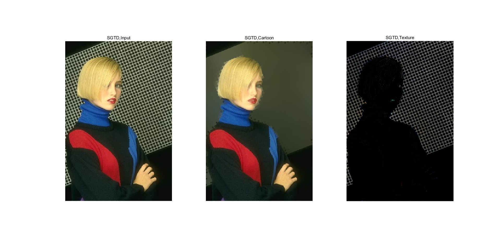

# matlabcode_SGTD
SGTD: Structure gradient and texture decorrelating regularization  for image decomposition     
   
   
% The Code is created based on the method described in the following paper:     
Q. Liu, J. Liu, P. Dong, D. Liang. SGTD: Structure gradient and texture decorrelating regularization for image decomposition,    
The IEEE International Conference on Computer Vision (ICCV), 1081-1088, 2013.

## Demonstration of SGTD
  
One example of SGTD. Left: Input image, Middle: Cartoon component, Right: Texture component.

## Other Related Projects
  * Adaptive dictionary learning in sparse gradient domain for image recovery [**[Paper]**](https://ieeexplore.ieee.org/document/6578193/)   [**[Code]**](https://github.com/yqx7150/GradDL) 

  * GcsDecolor: Gradient Correlation Similarity for Efficient Contrast Preserving Decolorization [**[Paper]**](https://ieeexplore.ieee.org/abstract/document/7088620)   [**[Code]**](https://github.com/yqx7150/GcsDecolor)   [**[Slide]**](https://github.com/yqx7150/EDAEPRec/tree/master/Slide)
